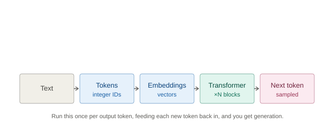
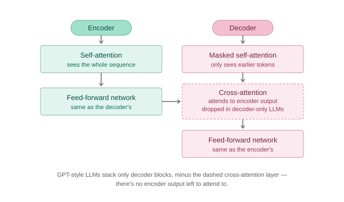
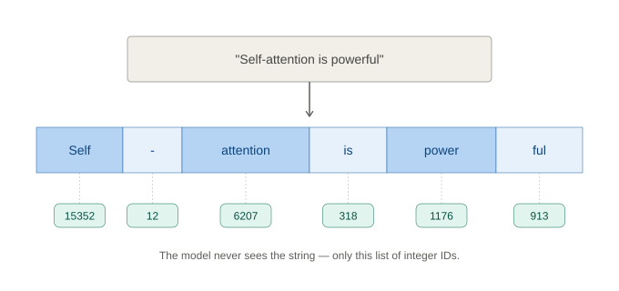
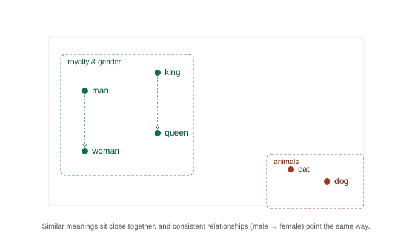
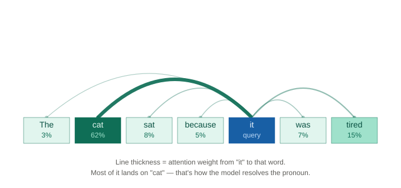
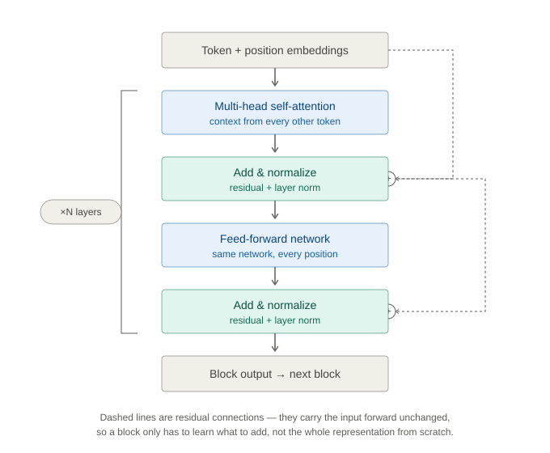
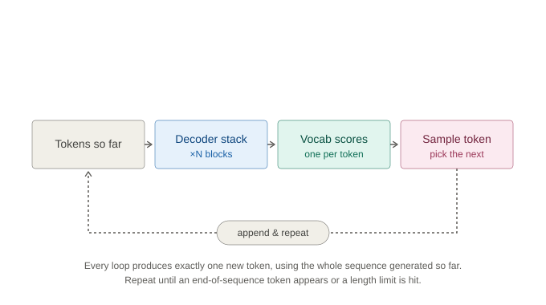

# How Transformer LLMs Work

*Part of my "From Transformers to Agents" series: what I'm learning from DeepLearning.AI's How Transformer LLMs Work*

I've spent plenty of time prompting these models without being able to explain what actually happens between hitting enter and words showing up on screen. This article is me closing that gap: the short version of tokenization, embeddings, attention, and the transformer block, plus the code I ran to actually watch each piece work.



## Series roadmap

This is article 1 of an 11-part series working through DeepLearning.AI's language model and agentic AI courses, grouped into four sections:

1. **Foundation (understanding the basics)**: how transformer LLMs work (this article), prompting fundamentals, function-calling and data extraction.
2. **Agentic AI deep dive (core patterns)**: agentic workflows, the four design patterns, reflection, tools and MCP.
3. **Orchestration (connecting it all)**: planning and multi-agent systems, evaluating agents for production, the A2A protocol.
4. **Deployment & implementation (operating at scale)**: prompting multi-agent systems in practice.

I'll keep the full breakdown up to date as a list on my Medium profile.

## TL;DR

- A neural network only understands numbers. Everything below is a different answer to: *how do you turn language into numbers without losing meaning?*
- **Tokenization** splits text into pieces and maps each to an ID.
- **Embeddings** turn each ID into a vector that captures meaning.
- **Encoder vs. decoder**: the original Transformer had both; GPT-style LLMs kept only the decoder half, running one masked stack that both builds meaning and predicts the next token.
- **Self-attention** lets each token pull in relevant context from every earlier token.
- **Transformer blocks** stack attention + a feed-forward layer, N times, to produce the next-token prediction.
- Generation loops this whole pipeline once per output token.

## Why transformers, and not something simpler

Before transformers made sense to me, I had to understand what they replaced: recurrent neural networks (RNNs), which process a sentence by reading one word, updating a hidden "memory" state, reading the next word, and so on to the end. Two problems fall out of that design:

- It's sequential: word 50 can't be processed until words 1–49 have been, one at a time. That's slow on hardware built to do many things in parallel, not one thing fifty times in a row.
- Memory decays: everything the model knows about word 1 has to survive being repeatedly overwritten across 49 update steps before it can influence word 50. In long sentences, early context quietly fades.

Transformers, introduced in the 2017 paper "Attention Is All You Need," remove the sequential step entirely: every word looks at every other word directly, in one parallel pass, through self-attention, with no relay race of hidden states. That single idea is what the rest of this article, and the rest of the course, keeps building on.

## Encoder vs. decoder — and why LLMs kept only one

This is the part of the course I originally skimmed past, because it read like architecture trivia. It isn't. The original 2017 Transformer wasn't built to generate text freely. It was built for translation, and it has two halves. The **encoder** reads the full input sentence and turns it into a set of context-rich representations; its self-attention is bidirectional, so every token can look both forward and back at every other token at once. The **decoder** then generates the output sentence one token at a time. It's built from the same two ingredients (self-attention, then a feed-forward network) plus one addition: a cross-attention layer that lets it look at the encoder's representations to figure out which parts of the input are relevant to the word it's generating next.

The detail that made the rest of this article make sense: the decoder's self-attention is also **masked**. When generating word 5, it's only allowed to attend to words 1 through 4, never to words it hasn't produced yet. This is why generation is **autoregressive**: each new token can only depend on what's already been written, not on what comes next.



This two-halves design is still exactly right for translation, but most of what I'll actually be using through this series picked one half:

- **Encoder-only**: BERT (2018) keeps just the encoder stack and drops generation entirely. Trained with masked language modeling (hide a word, predict it from both directions), it's built for *representing* language: classification, clustering, semantic search. The book calls this family **representation models**.
- **Decoder-only**: GPT-1 (2018) keeps just the decoder stack, and drops the cross-attention layer with it, since there's no encoder output left to attend to. What's left is masked self-attention plus a feed-forward network, repeated N times, trained to predict the next token. The book calls this family **generative models**, and this is the shape (scaled from GPT-1's 117 million parameters to GPT-3's 175 billion) that everything else in this series is actually about.

A GPT-style LLM is specifically the decoder half, alone. Modern models don't bother with a separate encoder stack at all, so every mechanism from here on (tokenization, embeddings, self-attention, the block) happens inside that decoder-only shape, not the full translation architecture the 2017 paper's diagram usually shows.

## Tokenization: text becomes numbers

Before a transformer's decoder can do anything with a sentence, that sentence has to become numbers. Tokenization is step one: split the string into a sequence of smaller units, usually subwords rather than whole words, then look each one up in a fixed vocabulary to get an integer ID.

Subword tokenization is a deliberate compromise, not an implementation detail. Whole-word tokens make the vocabulary huge and can't handle a word the tokenizer has never seen. Single characters keep the vocabulary tiny but turn every sentence into a very long sequence. Splitting text into frequent chunks (common word pieces and suffixes like "-ful" get their own token) keeps the vocabulary manageable while still covering unfamiliar words by breaking them into pieces it does recognize. That's why a huge vocabulary isn't needed: GPT-4's tokenizer covers effectively any English text with around 100K token pieces total.

> **A common mix-up:** tokens aren't universal. The same sentence tokenizes differently depending on which model's tokenizer you're using — BERT, GPT-2, and GPT-4 each split an unusual word into a different number of pieces. There's no single "correct" tokenization, only the one a given model was trained on.



```python
# See how a real tokenizer splits a sentence into pieces + IDs
# pip install transformers
from transformers import AutoTokenizer

tokenizer = AutoTokenizer.from_pretrained("gpt2")
text = "My overjoyed squirrel stole peanuts."

for token_id in tokenizer(text)["input_ids"]:
    print(f"{token_id:>6}  ->  {tokenizer.decode([token_id])!r}")
```

Full script: [`01_tokenization.py`](scripts/01_tokenization.py)

## Embeddings: giving numbers meaning

A token ID is just an arbitrary index. The ID for "king" carries no more relationship to "queen" than it does to "bicycle." Embeddings are the fix: an embedding layer is a lookup table mapping each token ID to a vector of a few hundred numbers, learned during training so that words used in similar contexts end up with similar vectors.

Real embeddings have hundreds of dimensions, but the geometry they learn is easiest to see squashed down to two. Words with related meanings cluster together, and some relationships come out as consistent directions: the vector from "man" to "woman" points roughly the same way, and the same distance, as the vector from "king" to "queen."



The same idea shows up outside language too: song-recommendation engines embed tracks from playlists the same way, and search engines embed whole documents, all to place similar things near each other in vector space.

```python
# Cosine similarity between two words' embedding vectors
# pip install transformers torch
import torch
from transformers import AutoTokenizer, AutoModel

tokenizer = AutoTokenizer.from_pretrained("bert-base-uncased")
model = AutoModel.from_pretrained("bert-base-uncased")
table = model.get_input_embeddings().weight

def vector_for(word):
    return table[tokenizer.convert_tokens_to_ids(word)]

for a, b in [("coffee", "espresso"), ("coffee", "guitar")]:
    sim = torch.cosine_similarity(vector_for(a), vector_for(b), dim=0)
    print(f"similarity({a!r}, {b!r}) = {sim.item():.3f}")
```

Full script: [`02_embeddings.py`](scripts/02_embeddings.py)

Embeddings solve the meaning problem, but on their own they're static: the vector for "bank" is identical whether the sentence is about a river or a savings account. That's the gap self-attention closes next.

## Self-attention: the mechanism that changed everything

Take the sentence "The cat sat because it was tired." To figure out what "it" refers to, you have to look back at the rest of the sentence, specifically at "cat." Self-attention is what lets the model do exactly that: for every token, it looks at every other token in the sequence, scores how relevant each one is, then blends their vectors together weighted by that relevance.

Mechanically, each token's embedding gets projected into three vectors: a **query** (what this token is looking for), a **key** (what this token offers to others), and a **value** (the content it contributes if attended to). A token's query is compared against every other token's key to produce a relevance score; those scores turn into weights that sum to 1 via softmax; and the token's new representation becomes the weighted sum of every value vector, using those weights. And since I now know I'm really talking about the decoder's version of this: those "every other token" comparisons only look backward, thanks to the masking from the last section.

Transformers don't do this just once. They run many attention **heads** in parallel, each free to specialize in tracking a different kind of relationship — one might track pronoun references, another might track verb-subject pairs — then combine all the heads' results together.



```python
# Self-attention from scratch on toy vectors -- numpy only,
# so the two steps stay visible instead of hiding in a framework call.
import numpy as np

def softmax(x):
    e = np.exp(x - np.max(x))
    return e / e.sum()

tokens = ["Maya", "walked", "the", "dog"]
X = np.array([[1,0,1,0], [0,1,0,1], [1,1,0,0], [0,0,1,1]], dtype=float)

np.random.seed(0)  # untrained, random projections -- illustrates the mechanism only
W_query, W_key, W_value = (np.random.rand(4, 4) for _ in range(3))
queries, keys, values = X @ W_query, X @ W_key, X @ W_value

current = -1  # "dog"
weights = softmax(queries[current] @ keys.T)     # step 1: relevance scoring
context_vector = weights @ values                 # step 2: combine information

for token, weight in zip(tokens, weights):
    print(f"{token:>6}: {weight:.2%} relevant to 'dog'")
```

Full script: [`03_self_attention.py`](scripts/03_self_attention.py)

Running this for every token at once updates every word's representation based on the words around it, in parallel, in a single matrix multiplication, with no step-by-step relay of hidden state. That parallelism is the whole point, and it's the detail I keep coming back to as the actual answer to "why transformers."

## The transformer block: stacking it all together

Self-attention on its own only mixes information between tokens — it never asks what any single token's new representation actually means. That's the feed-forward network's job: the same small neural network, applied independently to every token's vector, giving the model a place to process what attention just gathered.

The feed-forward layer is also where most of a model's factual memorization actually lives, which is why a model reliably completes "peanut butter and" with "jelly" almost every time.

Around both of these sits a residual connection: each sub-layer's output is added back to its input, rather than replacing it, and the result is normalized. This is the part I almost skipped past as boilerplate, but it matters more than it looks: it means a sub-layer only has to learn what to *add* to the representation, not reconstruct it from scratch, which is what makes it possible to stack this block dozens or hundreds of times without training collapsing.



Stack this block N times (12 layers for GPT-1, dozens for the larger models the course and the book both reference) and each layer builds on the representations the last one produced. Early layers pick up local, syntactic patterns; later layers combine those into more abstract, longer-range meaning. That framing, shallow-to-deep rather than just "more of the same," is what finally made "stack it N times" feel like an actual design choice instead of a hyperparameter.

After the last block, a separate layer called the **LM head** turns that block's output vector into a probability score for every token in the vocabulary. The highest-scoring token, or a sampled one, becomes the next output token — which is exactly the generation loop covered next.

Modern models add tweaks on top of this same skeleton — RMSNorm, rotary position embeddings, grouped-query attention — but the core pattern, attention then feed-forward repeated N times, hasn't changed since the original paper.

## From tokens to text: the generation loop

Everything above (tokenizing, embedding, attending, stacking blocks, the LM head) happens inside a single forward pass, and produces exactly one thing: a probability distribution over the entire vocabulary for what token comes next. Generating a whole paragraph is just that forward pass, run in a loop, with the decoder's masking making sure each new prediction only looks at what's already been generated.



```python
# The autoregressive loop underneath every chat response, made explicit
# pip install transformers torch
from transformers import AutoModelForCausalLM, AutoTokenizer
import torch

tokenizer = AutoTokenizer.from_pretrained("gpt2")
model = AutoModelForCausalLM.from_pretrained("gpt2")
input_ids = tokenizer("This transformer block is composed of", return_tensors="pt").input_ids

for _ in range(8):
    with torch.no_grad():
        logits = model(input_ids).logits        # forward pass through every block
    next_id = logits[0, -1].argmax()             # greedy: pick highest-probability token
    input_ids = torch.cat([input_ids, next_id.view(1, 1)], dim=1)  # append, then repeat

print(tokenizer.decode(input_ids[0]))
```

Full script: [`04_generation_loop.py`](scripts/04_generation_loop.py)

Temperature controls how sharply the model commits to its highest-scoring guess: near 0, it almost always picks the single most likely token (deterministic, sometimes repetitive); higher values flatten the distribution, giving lower-probability tokens a real chance (more varied, sometimes less coherent). Every major LLM API exposes this as a parameter for exactly that reason.

## What's next

Article 2 covers prompting fundamentals: now that I know what's happening inside the model, how do you actually talk to it well?

### Sources

- DeepLearning.AI, ["How Transformer LLMs Work"](https://www.deeplearning.ai/courses/how-transformer-llms-work)
- Jay Alammar and Maarten Grootendorst, *Hands-On Large Language Models* (O'Reilly, 2024) — Chapter 1
- Vaswani et al., ["Attention Is All You Need"](https://arxiv.org/abs/1706.03762), NeurIPS 2017 — the original Transformer paper
- Devlin et al., ["BERT: Pre-training of Deep Bidirectional Transformers for Language Understanding"](https://arxiv.org/abs/1810.04805), 2018
- Radford et al., ["Improving Language Understanding by Generative Pre-training"](https://cdn.openai.com/research-covers/language-unsupervised/language_understanding_paper.pdf), 2018 — GPT-1

---

Diagrams and code in this article are my own. The tokenization, embeddings, and generation examples run real pretrained models via Hugging Face; self-attention is a from-scratch numpy illustration of the mechanism. None of it is reproduced from the course or the book.

## In this folder

| Path | What it is |
|---|---|
| [`how_transformer_llms_work.ipynb`](how_transformer_llms_work.ipynb) | Companion notebook — all four scripts below, run in order, for readers who want to follow along in one sitting |
| [`scripts/01_tokenization.py`](scripts/01_tokenization.py) | GPT-2 tokenizer, split a sentence into pieces + IDs |
| [`scripts/02_embeddings.py`](scripts/02_embeddings.py) | BERT embeddings, cosine similarity between word vectors |
| [`scripts/03_self_attention.py`](scripts/03_self_attention.py) | Self-attention from scratch on toy vectors (numpy only) |
| [`scripts/04_generation_loop.py`](scripts/04_generation_loop.py) | GPT-2 greedy decoding, the autoregressive loop made explicit |
| [`images/`](images) | The 7 diagrams above, as standalone SVGs |
| [`gist/`](gist) | The single concatenated file this article's Medium code embed is pasted from, see [`gist/GIST.md`](gist/GIST.md) |
