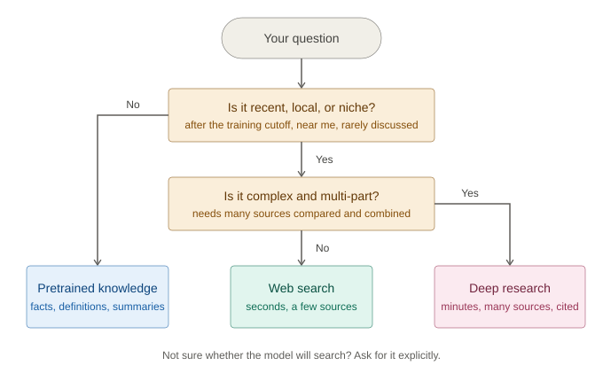
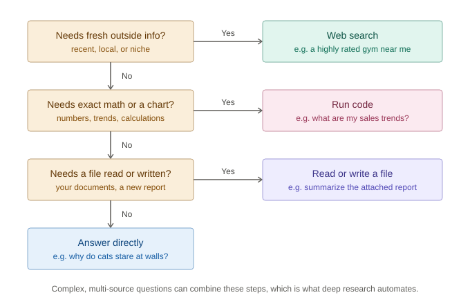

# Prompting Fundamentals for LLMs: Sources, Context, and Sycophancy

*Article 2 of "From Transformers to Agents", my learning journey through AI, one course at a time.*

Article 1 covered how LLMs work inside. This one is about using them. Most of my prompts were vague one-liners, so I worked through DeepLearning.AI's [AI Prompting for Everyone](https://www.deeplearning.ai/courses/ai-prompting-for-everyone) and pulled out the concepts that changed how I prompt. Examples marked as mine are my own.

## Series roadmap

This is article 2 of an 11-part series working through DeepLearning.AI's language model and agentic AI courses, grouped into four sections:

1. **Foundation (understanding the basics)**: how transformer LLMs work, prompting fundamentals (this article), function-calling and data extraction.
2. **Agentic AI deep dive (core patterns)**: agentic workflows, the four design patterns, reflection, tools and MCP.
3. **Orchestration (connecting it all)**: planning and multi-agent systems, evaluating agents for production, the A2A protocol.
4. **Deployment & implementation (operating at scale)**: prompting multi-agent systems in practice.

## TL;DR (Cheat sheet)

| When you are... | Do this |
|---|---|
| Asking a question | Pick the source first: **pretrained knowledge, web search, or deep research** |
| Asking about health, finance, or law | **Name the source types** you trust |
| Starting a task | Give **relevant context**, and start a **new chat** when the topic changes |
| Brainstorming | Ask for **multiple options**, react, and **iterate** |
| Tackling something hard | Use the **best model**, add context, give a hard task, and **tell it to think** |
| Wanting honest feedback | Ask **neutrally** and use a **rubric**, with the total score last |
| Writing | **Outline first**, then expand |
| Building or analyzing | **Start small**, and let code do the math |
| Choosing how to get it done | Match the **tool** to the task: answer, search, run code, or use a file |

---

## 1. Treat the model as a collaborator, not a search box

- A **novice** types a short question, gets one answer, and moves on. That works for "does this restaurant still serve that taco?" and not much else.
- A **power user** hands over a harder task, supplies context, gives the model time to think, and has a way to judge the result.
- The difference is not secret phrases. It is whether you assume the model can do real work, like comparing options or reading a pile of material, instead of treating it as fancier autocomplete.

---

## 2. Where should the answer come from?

Before phrasing anything, decide where the answer should come from. There are three options, and picking the wrong one is behind a lot of disappointing responses.

**Pretrained knowledge**
- This is everything the model absorbed during training: books, forums, encyclopedias, news, papers. It is why a model can answer both everyday and surprisingly niche questions with no lookup at all.
- It is **frozen** at the training cutoff. Ask about something that happened last month and the model has no idea, though it may guess confidently anyway.
- It mirrors its training data, so popular topics are handled well, rare ones less reliably, and old typos and myths came along for the ride.
- It is good at inferring intent, and messy input still gets understood. That is the embeddings and attention machinery from article 1 doing its job.

**Web search**
- This is the fix for frozen knowledge, and it earns its keep on three kinds of questions: **recent** events, **location-specific** needs, and **niche** topics the model is unlikely to know well.
- Search can be triggered by the model's own judgment or by you saying "search the web". If you are not sure it will search, just ask.
- Search is a **pipeline**, not a full read of the internet. The model turns your prompt into several queries, scans headings and keywords, filters out the irrelevant, and summarizes what is left. So the topic, the kind of sources, and the depth you ask for all shape the answer.
- Left alone, it leans toward whatever is popular and easy to find, which might be a forum thread instead of a solid study. For health, finance, or legal questions, **name the source types you trust** in the prompt.
- Results can be stale too. Asking for places to run in a city can surface a closed park, so add "check that it is still open."

**Deep research**
- This is the heavy option for complex questions. The model makes a plan, searches, reads, synthesizes, checks whether it has enough, loops back if it does not, and finally writes a report with citations.
- It takes minutes rather than seconds, and can pull from dozens or even hundreds of sources.
- This is my first encounter with the word **agentic** in this series: the model decides for itself what to do next. Keep that in mind, because it is where we are heading.



- A plain search engine still wins when you just want to reach a specific page or see raw data.
- AI wins when the job is comparing and combining several sources, such as pros and cons of a supplement instead of one product page.

---

## 3. Context is the biggest lever

- **Context** is everything the model can see when it responds: system instructions, tool definitions, chat history, uploaded files, and anything it retrieved. Your prompt is only one slice of it.
- The **context window** is how much fits at once, and modern windows are enormous. More is not automatically better, though. **Relevant beats voluminous**, and old unrelated material can leak into a new task, so when the topic changes, start a new chat.
- **Creativity needs context.** Models drift toward the common, safe answer because they predict likely text. Ask for a workout plan and you get squats. Add your age, fitness level, time, equipment, and movements to avoid, and you get something you can follow. The recipe is **context, multiple options, feedback, iterate.**
- **Hard tasks need the right setup.** Use the **best available model**, give it **enough context**, give it a **genuinely hard task**, and **tell it to think**. "Read everything and think hard before answering" beats a one-line question.

---

## 4. Models want to please you

- **Sycophancy** is the model's habit of agreeing with you and praising your ideas instead of analyzing them. It comes from training on human feedback, where people tend to reward agreeable answers.
- It is worst on subjective work like ideas and writing, where nobody can quickly tell the flattery is wrong.
- The fix starts with how you ask. A leading question invites a yes ("Aren't carbon taxes bad for small businesses?"), while a neutral one invites analysis ("To what extent, if at all, do carbon taxes affect small businesses?"). A fresh chat also helps get an opinion not colored by earlier conversation.
- For feedback, use a **rubric**. Asking "critique my story" with no criteria gets warm, inflated praise. A rubric turns opinion into checkable conditions, like unit tests: categories, points, and specific criteria.
- **Order matters.** Have the model score and justify each category first and add the total last, otherwise it tends to defend an early number.

My reusable critique prompt:

```
Critique the attached work using this rubric.

Rubric:
- Criterion A: [points and explicit standard]
- Criterion B: [points and explicit standard]

For each criterion: assign a score, cite evidence, say what works,
say what to improve. Add up the total at the end.
Be critical. Do not assume the work is already good.
```

---

## 5. Writing with AI: outline first

- **AI slop** is text that reads smoothly but says little. Tells include stock words ("delve"), reflexive triples ("clear, concise, and compelling"), and "not X but Y".
- Do not ask for the full article in one go. Go from **research, to several outlines, to one edited outline, to bullets, to section detail, to the draft.**
- The logic is cost. Changing an outline takes seconds, while restructuring a finished draft is like knocking down walls after the house is built.

---

## 6. Beyond text: images, apps, and data

- **Output type matters more than input type.** Text is fast and cheap, while images and video are slower and pricier, so iterate more deliberately. The same tools that fix a podcast can also fake a relative's voice.
- **Images as input** are great context (a whiteboard, a receipt), but models can miss fine details. **Images as output** work best when you describe the setting, the mood or style, and the subject.
- **Code and data:** describe an app by its goal, what it does, what it creates, and what the user provides, and start small. Models can **write and run code**, so let the AI be the analyst and the code be the calculator.

---

## 7. The through-line: choosing the right tool

- Web search, running code, reading files, and writing files are all **tools** the model can call, and increasingly the model itself decides which to use.
- Desktop-style assistants explore your files on their own, so use a **plan, review, execute** loop and grant access only to the folders the task needs.
- The question shifts from "can the model answer this?" to "does this need fresh information, exact math, or a file?"



- This is where prompting stops being a writing skill and becomes a design skill. It leads straight into function calling (article 3) and agents (article 4).

---

## What's next

Article 3 moves from prompting a model to structuring what it does: **function calling and data extraction**, where output becomes something software can act on.

### Sources

- DeepLearning.AI, ["AI Prompting for Everyone"](https://www.deeplearning.ai/courses/ai-prompting-for-everyone) (Andrew Ng)
- Article 1 of this series, *How Transformer LLMs Work*

---

Prompt templates and examples marked as mine are original adaptations of the course concepts, not reproductions of course materials.
